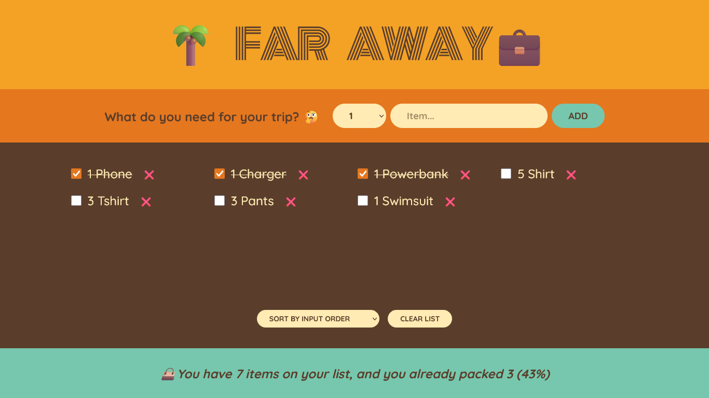

# 🌴 Far Away 💼

This is a travel list app built during the [**"The Ultimate React Course 2025: React, Next.js, Redux & More"**](https://www.udemy.com/course/the-ultimate-react-course/) by **Jonas Schmedtmann**.

This app allows users to create a packing list for a trip. You can add items you need to pack, mark them as packed, delete them, and sort the list. It also shows you statistics about your packing progress.

---

## ✨ Features

- **Add items** to the packing list with a description and quantity.
- **Delete items** from the list.
- **Mark items as packed** by checking them off.
- **Sort items** by input order, description, or packed status.
- **Clear the entire list** with a single click.
- **View statistics** on the number of items and how many are packed.

---

## 🚀 How to Use

1. **Go to this site:** [Far Away](https://darkoray.github.io/Far-Away-App/)
2. **Add an item:** Use the form to select a quantity, enter an item description, and click "Add".
3. **Pack an item:** Click the checkbox next to an item to mark it as packed. The item will be struck through.
4. **Delete an item:** Click the "❌" button to remove an item from the list.
5. **Sort the list:** Use the dropdown menu in the list section to sort your items.
6. **Clear the list:** Click the "Clear list" button to remove all items. You will be asked for confirmation.

---

## 🛠️ Technologies Used

- **React** (Functional Components & Hooks like `useState`)
- **JavaScript (ES6+)**
- **CSS3**
- **HTML5**

---

## 🧩 Components

- `App.js`: The main application component that holds and manages the state for the item list.
- `Logo.js`: A simple component to display the application's title.
- `Form.js`: The component containing the form to add new items to the packing list.
- `PackingList.js`: The component that displays the list of items, and includes controls for sorting and clearing the list.
- `Item.js`: The component for rendering a single item in the list, with controls for toggling packed status and deleting the item.
- `Stats.js`: The component for displaying statistics about the list, such as the number of items and the percentage packed.

---



---

## 📂 Project Structure

```
travel-list/
├─ public/
│ ├─ favicon.ico
│ ├─ index.html
│ ├─ logo192.png
│ ├─ logo512.png
│ ├─ manifest.json
│ └─ robots.txt
├─ src/
│ ├─ components/
│ │ ├─ App.js
│ │ ├─ Form.js
│ │ ├─ Item.js
│ │ ├─ Logo.js
│ │ ├─ PackingList.js
│ │ └─ Stats.js
│ ├─ index.css
│ └─ index.js
├─ .gitignore
├─ package-lock.json
├─ package.json
├─ README.md
└─ screenshot.png
```

---

## 📄 License & Credits

This project is part of a course and provided for **learning purposes only**.
© by Jonas Schmedtmann. You can use it for your portfolio or learning. Don't use it to teach or redistribute as your own work.
